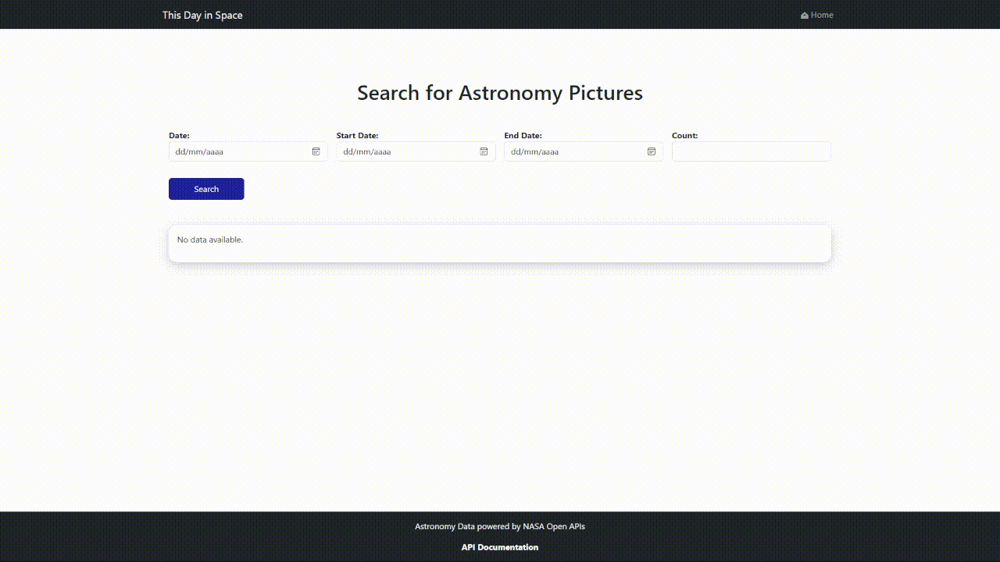
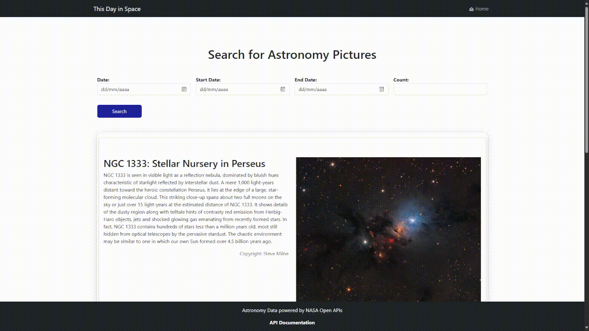
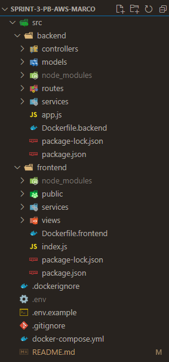

# Desenvolvimento da aplicação [*'This day in Space'*](http://44.201.85.78:3001/)

## 👨‍💻👩‍💻 Projeto desenvolvido por: [José Pedro Cândido L.P.](https://github.com/PeterYouseph), [Michael Lee Alves](https://github.com/AlvesMichael23), [Rafael Torres Nantes](https://github.com/rafael-torres-nantes) e [Sarah Baraldi](https://github.com/mbaraldi-sarah).

## 📚 Contextualização do projeto

This day in Space é um projeto que visa trazer informações sobre eventos espaciais que ocorreram em uma determinada data. A aplicação permite que o usuário selecione uma data específica, um range de datas ou uma quantidade de dias a partir da data atual, e a partir disso, são exibidas informações sobre eventos espaciais que ocorreram nesse dia.
Os dados são obtidos através da API da NASA [Astronomy Picture of the Day (APOD)](https://api.nasa.gov/), que fornece informações sobre eventos espaciais da comunidade científica e astronômica.

A API APOD é uma API RESTful que fornece informações sobre eventos espaciais, como imagens, vídeos, descrições, datas, entre outros. A API é gratuita e não requer autenticação para acessar os dados. Para acessar a API, é necessário fazer uma requisição HTTP GET para o endpoint `https://api.nasa.gov/planetary/apod`, passando como parâmetro a chave de acesso à API (API Key), que é fornecida gratuitamente pela NASA através de um cadastro no site [NASA API Portal](https://api.nasa.gov/).


## 🖥️ Funcionamento do sistema

### Descrição dos fluxos de utilização do sistema e funcionalidades

#### Fluxo de utilização 1: Seleção de uma data específica 

- O usuário seleciona uma data específica no calendário e clica no botão "Search". Assim a aplicação faz uma requisição à API APOD passando a data selecionada como parâmetro. A API retorna as informações sobre eventos espaciais que ocorreram nessa data, e a aplicação exibe essas informações na tela.



#### Fluxo de utilização 2: Seleção de um *range* de datas

- O usuário seleciona um range de datas no calendário e clica no botão "Search". Assim a aplicação faz uma requisição à API APOD passando as datas selecionadas como parâmetro. A API retorna as informações sobre eventos espaciais que ocorreram nesse range de datas, e a aplicação exibe essas informações na tela.



#### Fluxo de utilização 3: Seleção de uma quantidade de dias a partir da data atual

- O usuário seleciona uma quantidade de dias a partir da data atual e clica no botão "Search". Assim a aplicação faz uma requisição à API APOD passando a data atual e a quantidade de dias selecionada como parâmetro. A API retorna as informações sobre eventos espaciais que ocorreram nesses dias, e a aplicação exibe essas informações na tela.


## 🛠️ Tecnologias/Ferramentas utilizadas

### Para a implementação do projeto, foram utilizadas as seguintes tecnologias/ferramentas:

#### Estrutura visual base da aplicação Frontend:

[](https://handlebarsjs.com/)
[](https://developer.mozilla.org/pt-BR/docs/Web/HTML)

#### Estilização da aplicação Frontend:

[](https://getbootstrap.com/)
[](https://developer.mozilla.org/pt-BR/docs/Web/CSS)

#### Desenvolvimento da lógica da aplicação (Backend e Frontend):

[](https://developer.mozilla.org/pt-BR/docs/Web/JavaScript)
[](https://nodejs.org/en/)
[](https://expressjs.com/pt-br/)
[](https://axios-http.com/)

##### Ferramentas para o desenvolvimento, versionamento e *deploy* do projeto:

[](https://code.visualstudio.com/)
[](https://www.postman.com/)
[](https://git-scm.com/)
[](https://github.com/)
[](https://www.docker.com/)
[](https://aws.amazon.com/pt/)
[](https://aws.amazon.com/pt/cli/)
[](https://aws.amazon.com/pt/ec2/)

##### API utilizada:

[](https://api.nasa.gov/)

##### Organização do Time:

[](https://trello.com/)
[](https://www.microsoft.com/pt-br/microsoft-teams/group-chat-software)

## 📁 Estrutura do projeto 

### O projeto foi dividido nos seguintes diretórios, baseando-se no modelo MVC (Model-View-Controller) com devidas adaptações:



#### Divisão dos diretórios principais:
- ***`./src/frontend` →*** Responsável pela parte visual da aplicação, contendo as páginas Handlebars, estilizações CSS e scripts JS que consomem os dados vindos do backend;

- ***`./src/backend` →*** Responsável pela parte lógica da aplicação, contendo os arquivos de configuração do servidor, rotas, controllers, services e models que gerenciam o fluxo de informações da aplicação.

#### Divisão dos diretórios secundários:
- ***models →*** Responsável pela construção dos objetos a partir do body das requisições realizadas pela API. Visando organizar o que iremos utilizar ou não de cada requisição em nossa aplicação e deixá-la mais organizada e limpa;

- ***views →*** Páginas do frontend que irão consumir os dados vindos do nosso backend;

- ***controllers →*** Realizam a chamada dos services (em ./src/services) criados utilizando os endpoints da API, gerenciando o fluxo de informações para alimentar a aplicação frontend que realiza chamadas via routes (em ./src/routes).

- ***routes →*** Responsável por realizar as chamadas dos controllers e retornar as informações para o frontend.

- ***services →*** Realizam as chamadas dos endpoints da API, retornando as informações para os controllers.

- ***public →*** Diretório que contém os arquivos estáticos do projeto, como imagens e estilizações CSS.

- ***utils →*** Diretório que contém funções auxiliares para o projeto utilizado ao longo do desenvolvimento.

- ***docs →*** Diretório que contém a documentação do projeto e imagens utilizadas na mesma.

- Além disso, o projeto conta com os arquivos de configuração do Docker, do Docker Compose e do ambiente de produção no AWS.

#### Arquivos de configuração do Docker e Docker Compose:

- ***`./src/frontend/Dockerfile.frontend` →*** Arquivo de configuração do Docker para o frontend da aplicação.

- ***`./src/backend/Dockerfile.backend` →*** Arquivo de configuração do Docker para o backend da aplicação.

- ***`./docker-compose.yml` →*** Arquivo de configuração do Docker Compose para a execução do projeto.

- ***`./.dockerignore`*** → Arquivo que contém os diretórios e arquivos que serão ignorados pelo Docker.

## 📎 Diagrama de atividades da aplicação
### Fluxo de funcionamento e consumo da API 

- O diagrama de atividades abaixo representa o fluxo de funcionamento da aplicação, desde a conexão do usuário com a aplicação hospedada no AWS EC2, até a exibição das informações sobre eventos espaciais na tela do usuário.

```bash
   +------------------------+             +--------------------------+
   |                        |             |                          |
   |       Usuário          |             |    Máquina EC2 da AWS    |
   |                        |             |                          |
   +------------------------+             +--------------------------+
        - Acessa a aplicação                - Recebe a requisição
            |                                           |
                |   +----------------------------+  |
                    |   Acessa o IPv4 público    |
                    +---------------------------->
                    |                            |
                    |                            |
                    |   Exibe a interface do     |
                    |   Frontend                 |
                    |<---------------------------+
                    |                            |
                    |                            |
                    |   Interage com a interface |
                    +--------------------------->|
                    |                            |
                    |   Frontend consome dados   |
                    |   do Backend               |
                    +--------------------------->|
                    |                            |
                    |   Backend consome dados    |
                    |   da API da NASA           |
                    +--------------------------->|
                    |                            |
```


## 📌 Como executar o projeto

### Clone o repositório

```bash
$ git clone https://github.com/Compass-pb-aws-2024-MARCO/sprint-3-pb-aws-marco.git
```

### Acesse a pasta do projeto no terminal/cmd:

```bash
$ cd sprint-3-pb-aws-marco
```

### Realize um check-out para a branch de desenvolvimento:

```bash
$ git checkout equipe-8
```
#### Crie um arquivo .env na raiz do projeto e adicione a sua chave de acesso à API da NASA conforme o exemplo disponível em ./env.example

```bash
APOD_API_KEY=[INSIRA_SUA_CHAVE]
```

### Executando o projeto via Docker:

#### 1. Instale o Docker em sua máquina:

- Para instalar o Docker em sua máquina, siga as instruções do site oficial do Docker: [Docker](https://docs.docker.com/get-docker/)
- Após a instalação, verifique se o Docker foi instalado corretamente executando o comando `docker --version` no terminal.

#### 2. Execute o comando Composer para instalar as dependências do projeto e executar o projeto via Docker:

```bash
$ docker-compose up
```

#### 3. Acesse o projeto no navegador:

##### Acesso da aplicação via IP público do ***AWS EC2***

- A aplicação foi hospedada no ***AWS EC2*** e está disponível para acesso via IP público. Para acessar a aplicação, basta acessar o endereço [`This Day in Space`](http://44.201.85.78:3001/) no navegador.

##### Acesso através do localhost (caso deseje executar o projeto localmente)

- Após a execução do comando `docker-compose up`, a aplicação Backend estará disponível no endereço `http://localhost:3000/` e a aplicação Frontend estará disponível no endereço `http://localhost:3001/`.

## 🤯 Dificuldades encontradas 

### Dificuldades técnicas

#### Utilização da API da NASA (APOD)

- A API utilizada no projeto APOD (Astronomy Picture of the Day) da NASA, possui algumas particularidades nos retornos das requisições, como a possibilidade de retornar imagens, vídeos, descrições, datas, entre outros. Para lidar com essas particularidades, foi necessário realizar um tratamento dos dados retornados pela API, para exibir as informações de forma organizada e legível na aplicação.

#### Configuração do ambiente de produção no AWS com Docker

- O deploy da aplicação no AWS foi um dos maiores desafios enfrentados pelo time devido a inexperiência de todos, pois a configuração do ambiente de produção, a configuração do Docker e a configuração do AWS CLI e EC2 foram tarefas complexas e que demandaram um tempo considerável para serem realizadas.

### Dificuldades de organização

#### Organização do time e divisão de tarefas

- Devido a disponibilidade de tempo reduzida devido aos compromissos acadêmicos de cada membro do time e a complexidade do projeto, a organização do time e a divisão de tarefas foram desafios enfrentados pelo time. Mas com a comunicação constante e a colaboração de todos, foi possível superar esses desafios e entregar o projeto no prazo estabelecido.


